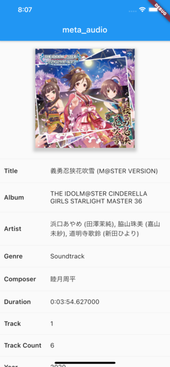
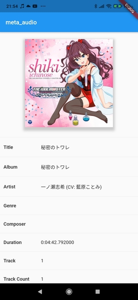

# meta_audio

meta_audio will give you an ability to parse metadata from audio files.

## Example

| iOS | Android |
| --- | --- |
|  |  |

## How to Use meta_audio

To parse metadata you need to write these 2 lines.

```dart
final parser = MetaAudio();
final metadata = await parser.parse('path/to/audio');
```

That's it! Now you can read any [Supported Metadata](#supported-metadata)

## Supported Metadata

| Metadata | iOS | Android |
| --- | --- | --- |
| Title | Yes | Yes |
| Album | Yes | Yes |
| Artist | Yes | Yes |
| Genre | Yes | Yes |
| Composer | Yes | Yes |
| Duration | Yes | Yes |
| Track Number | Yes | Yes |
| Number of Tracks | Yes | Yes |
| Year | Yes | Yes |
| Artwork | Yes | Yes |

## Supported Formats

| Type | iOS | Android |
| --- | --- | --- |
| mp3 | Yes | Yes |
| m4a | Yes | Yes |
| flac | Yes | Yes |
